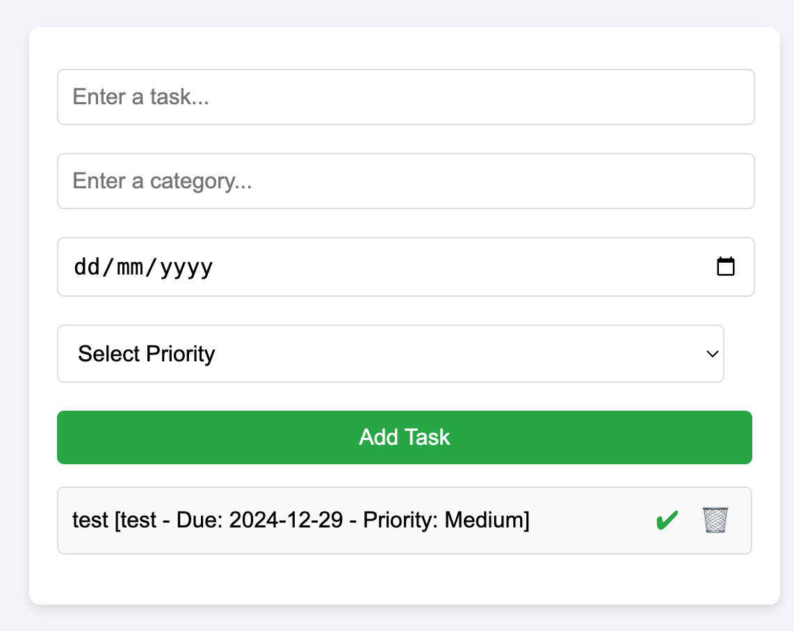

# To-Do List Application

This is a simple yet customizable **To-Do List Application** built using HTML, CSS, and JavaScript. The application allows users to add tasks with additional attributes such as categories, deadlines, and priority levels, providing a more organized and dynamic task management experience.

---

## Features

- **Add Tasks**: Create tasks with descriptions, categories, deadlines, and priorities.
- **Mark as Completed**: Strike through completed tasks.
- **Delete Tasks**: Remove tasks from the list.
- **Responsive Design**: Works seamlessly on various screen sizes.

---

## Project Structure

```plaintext
project-directory/
├── index.html    # Contains the HTML structure
├── style.css     # Styles for the app
└── app.js        # JavaScript functionality
```

---

## How to Run the Project

1. Clone or download the repository to your local machine:

   ```bash
   git clone <repository-url>
   ```

2. Open the `index.html` file in a web browser:

   ```bash
   open index.html
   ```

3. Start adding tasks and manage them dynamically.

---

## How It Works

1. Enter the **task description** in the input field.
2. Optionally fill in:
   - **Category**: Specify the type of task.
   - **Deadline**: Select a due date.
   - **Priority**: Choose between Low, Medium, or High.
3. Click the **Add Task** button to add the task to the list.
4. Interact with the tasks:
   - Click the checkmark (✔) to mark as completed.
   - Click the trash can (🗑) to delete the task.

---

## Future Enhancements

- **Filter Tasks**: Add filtering options by category, deadline, or priority.
- **Drag-and-Drop**: Enable reordering of tasks in the list.
- **Persistence**: Save tasks using Local Storage or a backend database.
- **User Accounts**: Allow user-specific task lists.
- **Full-Stack Integration**: Turn the app into a full-stack CRUD application.

---

## Full-Stack Integration Plan

### Steps to Turn the To-Do List into a Full-Stack CRUD App

1. **Set Up the Backend**:

   - Use a backend framework like **Node.js with Express.js**.
   - Create RESTful API endpoints for tasks:
     - `POST /tasks`: Add a new task.
     - `GET /tasks`: Retrieve all tasks.
     - `PUT /tasks/:id`: Update a task by ID.
     - `DELETE /tasks/:id`: Delete a task by ID.

2. **Database Integration**:

   - Use a database to store tasks:
     - **SQL**: PostgreSQL, MySQL.
     - **NoSQL**: MongoDB.
   - Define a schema for tasks:
     ```json
     {
       "id": 1,
       "task": "Buy groceries",
       "category": "Personal",
       "deadline": "2024-12-28",
       "priority": "High",
       "completed": false
     }
     ```

3. **Connect Frontend to Backend**:

   - Replace the current JavaScript logic with **AJAX** or **Fetch API** calls to the backend API.
   - Example: Fetch tasks from the API instead of using a local array.

4. **Deploy**:
   - Deploy the backend to a cloud service like **Heroku**, **Render**, or **AWS**.
   - Host the frontend using **Netlify**, **Vercel**, or **GitHub Pages**.

---

## Example Full-Stack Project Structure

```plaintext
project-directory/
├── backend/
│   ├── app.js          # Express server setup
│   ├── routes/tasks.js # API routes for tasks
│   ├── models/Task.js  # Task schema and database model
│   └── db.js           # Database connection
├── frontend/
│   ├── index.html      # Frontend structure
│   ├── app.js          # Fetch API to interact with backend
│   ├── style.css       # Styling
├── README.md           # Documentation
└── package.json        # For Node.js dependencies
```

---

## Screenshots


To-Do v1

---

## Change Log

### Version 1.0

- Created a **To-Do List Application** with the following features:
  - Add tasks with description, category, deadline, and priority.
  - Mark tasks as completed.
  - Delete tasks.
  - Responsive design for various screen sizes.
- Added a plan for future enhancements including full-stack integration.

---
